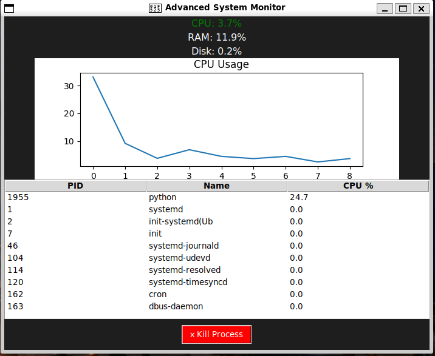

# 🔥 System Monitor (Python + Linux)

## 📌 Description
A GUI-based system monitoring tool that shows real-time CPU, RAM, and Disk usage.

## 🚀 Features
- Live CPU graph 📈
- RAM & Disk monitoring
- Top processes list
- Kill process feature ☠️

## 🛠 Tech Used
- Python
- Tkinter
- psutil
- Matplotlib
- Linux (Ubuntu)

## ▶️ Run
python gui_monitor.py# 🔥 System Monitor (Python + Linux)

## 📌 Description
A GUI-based system monitoring tool that shows real-time CPU, RAM, and Disk usage.

## 🚀 Features
- Live CPU graph 📈
- RAM & Disk monitoring
- Top processes list
- Kill process feature ☠️

## 🛠 Tech Used
- Python
- Tkinter
- psutil
- Matplotlib
- Linux (Ubuntu)

## ▶️ Run
python gui_monitor.py

## 📸 Screenshot

